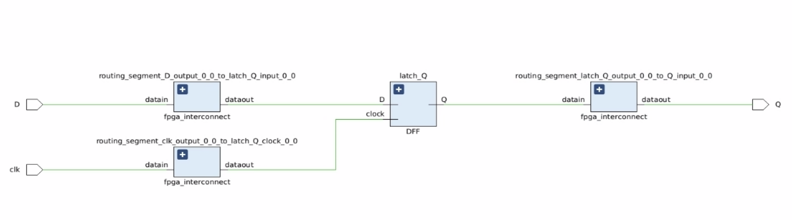
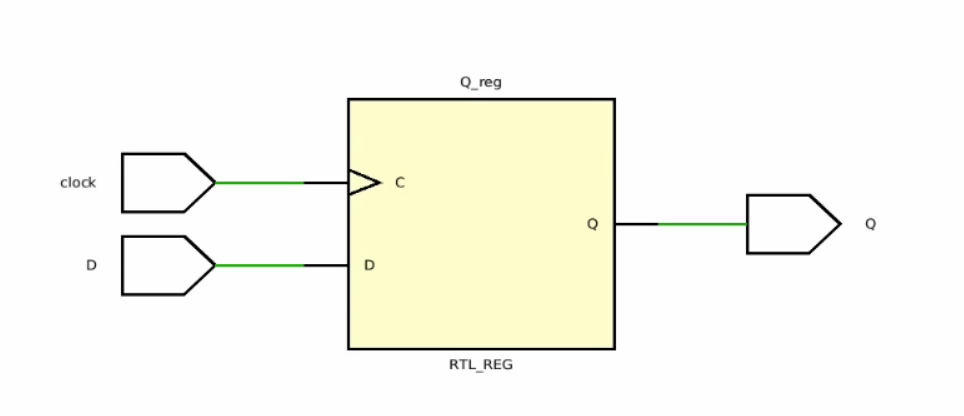
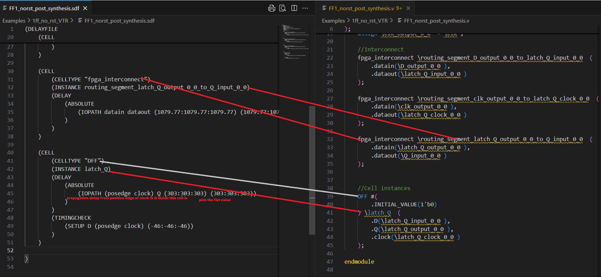

# How to use SDC file
This file exaplin how to handle SDC file. It is based on example `Examples/1ff_no_rst_VTR`

## Graphical view
when you display the post place and route netlist `Examples/1ff_no_rst_VTR/FF1_norst_post_synthesis.v` as graphical , you'll get this architecture:




There are new elements called fpga interconnect which were added. They are virtual elements created in order to collect wire delay timing from SDC. These elements are not physically real. They should not be displayed on the final graphic. The real display would be mode like this:



## SDF timing extraction 
SDF file `Examples/1ff_no_rst_VTR/FF1_norst_post_synthesis.sdf` add timing information for its associated verilog netlist file `Examples/1ff_no_rst_VTR/FF1_norst_post_synthesis.v`

Here is a view on how to interpret the two files together:


1. search for every instance name in the verilog netlist
2. look for associated instance name in sdf file.
    1. if it exists: collect propagation timing from IOPATH tag timing value
    2. if not : look for associated cell name
        1. if it exists: collect associated IOPATH tag timing value
        2. if not : put 0 delay propagation timing value

Extration of IOPATH timing value is as follow:
```(IOPATH datain dataout (1022.2:1022.2:1022.2) (1022.2:1022.2:1022.2)) ```

1. look for IOPATH tag
2. look for the path source and destination signals (here source is `datain` and destination is `dataout`)
3. get the first number (between `()` and `:`). here it is `1022.2` 

The timing scale for this number is set at the beginning of the sdf file : `    (TIMESCALE 1 ps)`
